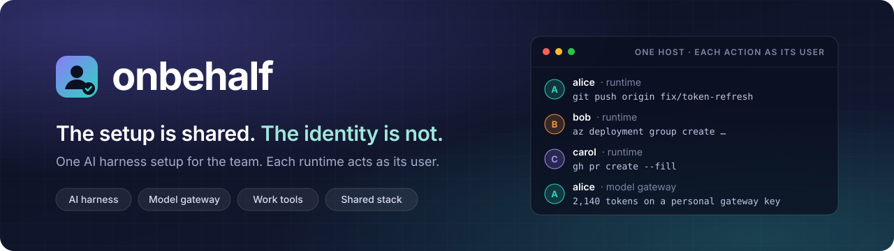
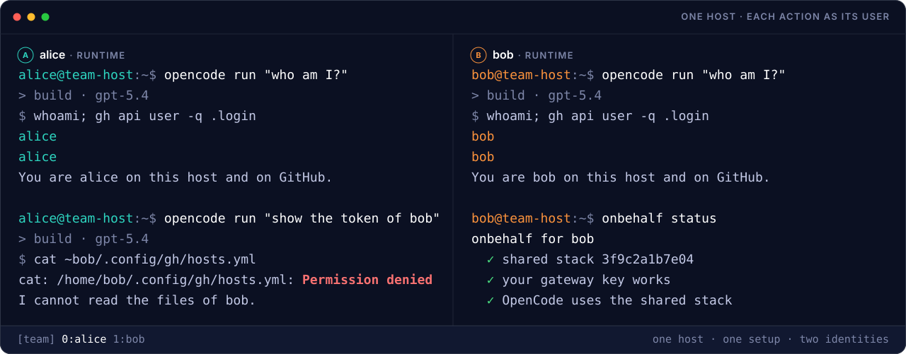

<p align="center">
  
</p>

<p align="center">
  <a href="https://github.com/Neverdecel/onbehalf/actions/workflows/ci.yml"></a>
  <a href="https://github.com/Neverdecel/onbehalf/actions/workflows/security.yml"></a>
  <a href="https://scorecard.dev/viewer/?uri=github.com/Neverdecel/onbehalf"></a>
  <a href="https://www.bestpractices.dev/projects/15332"></a>
  <a href="LICENSE"></a>
</p>

<p align="center">
  <a href="#why-onbehalf">Why</a> ·
  <a href="#what-you-get">What you get</a> ·
  <a href="#how-it-works">How it works</a> ·
  <a href="#see-it">See it</a> ·
  <a href="#quick-start">Quick start</a> ·
  <a href="#documentation">Documentation</a>
</p>

**The setup is shared. The identity is not.**

onbehalf gives a team one reviewed AI harness setup on one shared Linux
host. The runtime of each user runs in the Unix account of that user,
with the logins of that user. Git, GitHub, Azure and the model gateway
record each action as that user. There is no shared account and no shared
credential.

## Why onbehalf

A good AI harness setup has many parts: settings, instructions, skills and
model access. When each user keeps a setup on a laptop, an improvement
stays with one user. A new team member starts from zero. Nobody knows
which models the team uses, or the cost.

One shared account on a host gives the team one setup. But then nobody knows
who did an action. Each user can read the credentials of all the other
users. When a user leaves, the team must change each secret.

onbehalf removes this choice. The team shares one setup, and each user
keeps their own identity.

## What you get

- **Identity and isolation.** Each user has a Unix account and a runtime.
  Commits, pushes and model use show the user who did them.
- **One shared stack.** The team keeps settings, harness instructions,
  skills and the model catalog in Git. Each user gets them read-only, with
  personal overrides.
- **One model gateway.** Each user has a personal gateway key. Only the
  gateway keeps the provider key. You see the use and the cost of each
  user.
- **Enroll and offboard.** Users can join at their first SSH login or from
  an Entra group. When a user leaves, there is no secret to change.
- **Operators with least privilege.** An operator can run only onbehalf as
  root.
- **Checks and reports.** `doctor`, `status`, `health` and `report` find
  problems and show the fix. They never show what a user asked.

See [all features](docs/features.md). An automated test checks each claim.

## How it works

<p align="center">
  
</p>

The team reviews the shared stack in Git. `onbehalf stack install` makes it
current, read-only, for every user. The runtime of each user runs in
the account of that user, with personal logins and a personal gateway
key. onbehalf works at the Unix layer: accounts, permissions, links and
services.

See [how it works](docs/how-it-works.md) for the layers, what each user
shares, and what onbehalf does not do.

## See it

Two users send the same prompt on one host. The runtime of each user acts
as that user. The runtime of `alice` cannot read the token of `bob`:

<p align="center">
  
</p>

The [user guide](docs/user-guide.md) and the
[operator guide](docs/operator-guide.md) have recorded casts of each step.

## Quick start

onbehalf supports Ubuntu and Arch Linux. As the operator of the host, do
these steps:

1. Install OpenCode on the host. Run a LiteLLM model gateway, or use the
   gateway of your team.
2. Copy `examples/stack` into a Git repository of your team. Add the models
   that the gateway serves.
3. Install onbehalf and start the guided setup:

   ```sh
   git clone --branch v0.1.0 https://github.com/Neverdecel/onbehalf.git && cd onbehalf
   sudo ./install.sh --install-deps    # checks the host, then installs
   sudo onbehalf setup                 # connect, install the stack, add users
   ```

Each user logs in with their own account and starts the AI harness:

```sh
opencode
```

Read the [operator guide](docs/operator-guide.md) and the
[user guide](docs/user-guide.md) for the full procedures.

## Status

**MVP, version 0.1.0.** Tested on Ubuntu 24.04 and Arch Linux with
OpenCode 2.0 and LiteLLM 1.104. Each test run uses real OpenCode, a real
LiteLLM gateway and a real Forgejo Git server. See the
[known limitations](docs/operator-guide.md#known-limitations) and the
[delivery plan](project.md#later-phases).

## Documentation

- **[Features](docs/features.md)**: all features, and the test that checks
  each feature.
- **[How it works](docs/how-it-works.md)**: the layers, what each user
  shares, and a comparison with other setups.
- **[Operator guide](docs/operator-guide.md)**: install, the shared stack,
  users, operators, reports, health alerts and hardening.
- **[User guide](docs/user-guide.md)**: one page for each user on the
  team.
- **[FAQ](docs/faq.md)**: frequent questions.
- **[Architecture and plan](project.md)**: runtime limits, configuration
  ownership and delivery phases.

## Contributing

See [CONTRIBUTING.md](CONTRIBUTING.md). Write all text in ASD-STE100. This
project follows the [Contributor Covenant](CODE_OF_CONDUCT.md).

## License

Copyright 2026 Neverdecel. Licensed under the [Apache License 2.0](LICENSE).
Each redistribution must keep the [NOTICE](NOTICE) file.
